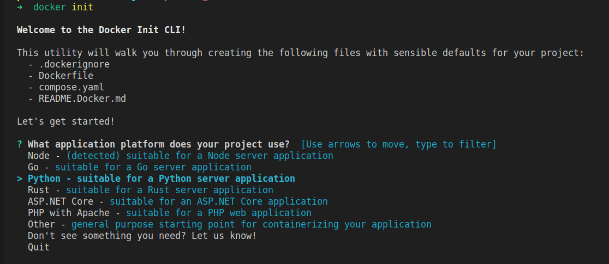
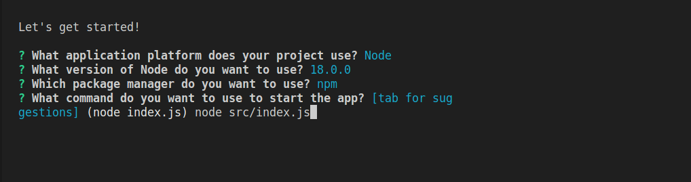
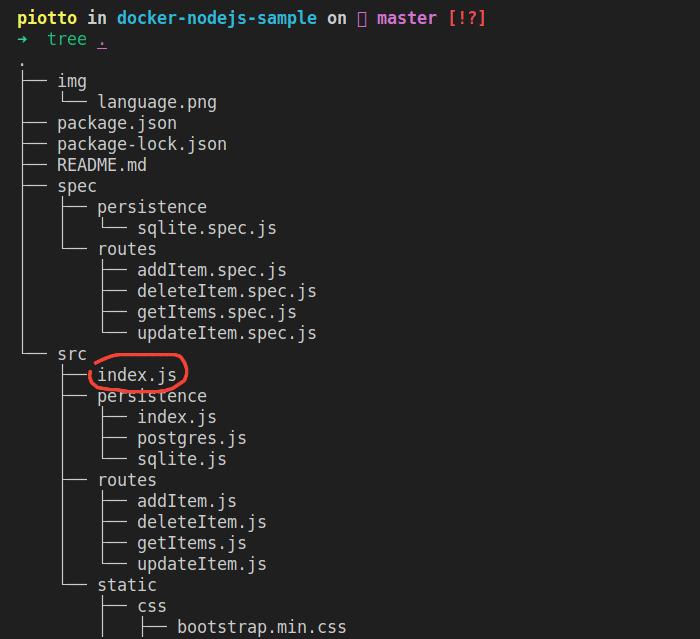

# Conteinerizando uma aplicacão NodeJS

Essa aplicação NodeJS foi pegada da documentação do Docker, sendo possível acessa-la por [aqui](https://docs.docker.com/language/nodejs/containerize/). Nela, temos todos os passo a passo de como conteineriza-la e sincronizar com um banco de dados.

## Clonando a aplicação

O primeiro passo é clonar a aplicação, ou seja, um pré-requisito desse projeto é você ter a ferramenta Git instalada em sua máquina.

Com o Git instalado, basta rodar esse comando:
```
git clone https://github.com/docker/docker-nodejs-sample
```

### Criando os arquivos do Docker

Existem duas formas de criar os arquivos Docker na sua aplicação, a maneira manual, quando você cria o Dockerfile e faz ele passo a passo, podendo ser melhor em aplicações mais específicais, nas quais você tem conhecimento e um dominio maior sobre a ferramenta. Outra maneira, é pelo comando abaixo:

```
docker init
```

> [!IMPORTANT]  
> Vale ressaltar que nesse ponto, deve estar instaldo e configurado o Docker na sua máquina para que tudo ocorra certo.

Algumas perguntas básicas serão feitas após o comando:



Nessa primeira opção, você deve escolher qual a linguagem da sua aplicação, no nosso caso de exemplo, eu vou escolher a linguagem Node. Depois, será perguntado a versão que a sua aplicação está rodando e qual instalador de pacotes está sendo utilizado, portanto, perguntas pessoais para cada projeto.



Nessa etapa, é de grande importancia, pois, vamos ter que passar o caminho no qual o arquivo da aplicação está, no meu caso, devo localizar o arquivo ```index.js```. Vou analisar a organização das pastas para te mostrar o caminho que estou utilizando:



